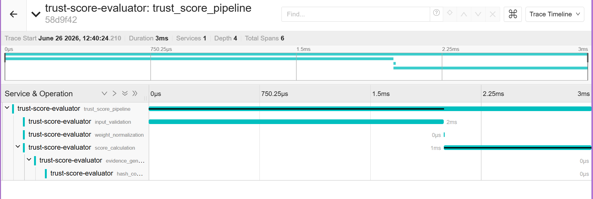

# Trust Score Evaluator with OpenTelemetry Tracing

This repository contains a Python Trust Score evaluator instrumented with OpenTelemetry manual spans.
The app exports traces to Jaeger so you can inspect the waterfall of validation, normalization, score calculation, evidence generation, and hash computation.

## Files

- `trust.py` — Python app with manual OpenTelemetry spans and span attributes.
- `requirements.txt` — Python dependencies for OpenTelemetry and the Jaeger exporter.
- `docker-compose.yml` — Jaeger all-in-one config for local tracing.

## Trace Design

The application creates a trace around the scoring pipeline and emits spans for each major stage:

1. `trust_score_pipeline` (root span)
2. `input_validation`
3. `weight_normalization`
4. `score_calculation`
5. `evidence_generation`
6. `hash_computation`

Each stage reports observability metadata to Jaeger for diagnostic and audit purposes.

## Setup

1. Install Python dependencies:

   ```bash
   python -m pip install -r requirements.txt
   ```

2. Start Jaeger:

   ```bash
   docker compose up -d
   ```

   Or using Docker directly:

   ```bash
   docker run -d --name jaeger \
     -e COLLECTOR_ZIPKIN_HOST_PORT=":9411" \
     -p 16686:16686 \
     -p 6831:6831/udp \
     -p 6832:6832/udp \
     -p 14268:14268 \
     jaegertracing/all-in-one:1.49
   ```

3. Run the instrumented Trust Score evaluator:

   ```bash
   python trust.py
   ```

4. Open Jaeger UI:

   ```
   http://localhost:16686
   ```

   Search for service `trust-score-evaluator` and inspect the trace waterfall.

## Choosing the Best Trace in Jaeger

1. In Jaeger Search, set Service to `trust-score-evaluator`.
2. Set Operation to `trust_score_pipeline` to show the full pipeline traces.
3. Use a recent time window (Last Hour) and click `Find Traces`.
4. Look for traces with `4 Spans` or `5 Spans` and the root span named `trust_score_pipeline`.
5. Click a trace result to open the waterfall view and verify the child spans are shown in order:
   - `input_validation`
   - `weight_normalization`
   - `score_calculation`
   - `evidence_generation`
   - `hash_computation`

## Jaeger Trace Waterfall Screenshot

The screenshot below shows a successful `trust_score_pipeline` trace with all required child spans.



## Expected Trace Output

The Jaeger trace should show the following spans with these attributes:

- `trust_score_pipeline`
  - `pipeline.dimensions`
- `input_validation`
  - `input.score_count`
  - `input.weight_count`
  - `input.valid`
  - `input.missing_dimensions` (when applicable)
  - `input.validation_error` (when validation fails)
- `weight_normalization`
  - `weight.sum_before`
  - `weight.sum_after`
  - `weight.large_warning_count`
- `score_calculation`
  - `score.dimension_count`
  - `score.trust_score`
  - `score.risk_level`
  - `score.risk_flags`
- `evidence_generation`
  - `evidence.score`
  - `evidence.risk_flags_count`
  - `evidence.dimension_count`
- `hash_computation`
  - `hash.algorithm`
  - `hash.output_length`
  - `hash.prefix`

## Notes

- The trace waterfall should show the ordered execution of the core spans.
- Errors are expected for invalid input cases and are reflected in `input_validation` spans.
- A valid screenshot must show `trust_score_pipeline` plus all child spans: `input_validation`, `weight_normalization`, `score_calculation`, `evidence_generation`, and `hash_computation`.
# Instrumented-Trust-Score-calculator-with-OpenTelemetry-tracing
